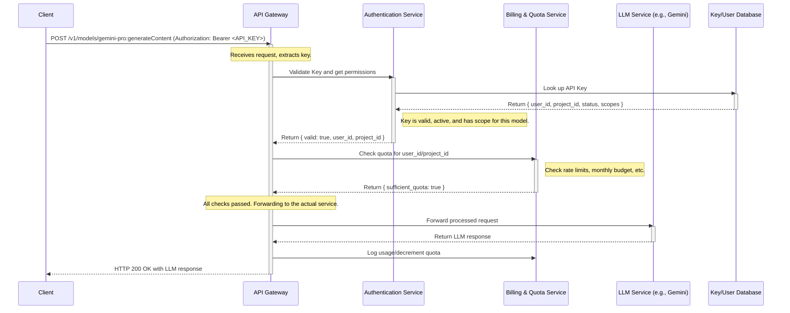

```mermaid
sequenceDiagram
    participant Client
    participant API_Gateway as API Gateway
    participant Auth_Service as Authentication Service
    participant Billing_and_Quota_Service as Billing & Quota Service
    participant LLM_Service as LLM Service (e.g., Gemini)
    participant Key_Database as Key/User Database

    Client->>API_Gateway: POST /v1/models/gemini-pro:generateContent (Authorization: Bearer <API_KEY>)
    
    activate API_Gateway
    Note over API_Gateway: Receives request, extracts key.
    API_Gateway->>Auth_Service: Validate Key and get permissions
    
    activate Auth_Service
    Auth_Service->>Key_Database: Look up API Key
    activate Key_Database
    Key_Database-->>Auth_Service: Return { user_id, project_id, status, scopes }
    deactivate Key_Database
    Note right of Auth_Service: Key is valid, active, and has scope for this model.
    Auth_Service-->>API_Gateway: Return { valid: true, user_id, project_id }
    deactivate Auth_Service
    
    API_Gateway->>Billing_and_Quota_Service: Check quota for user_id/project_id
    activate Billing_and_Quota_Service
    Note right of Billing_and_Quota_Service: Check rate limits, monthly budget, etc.
    Billing_and_Quota_Service-->>API_Gateway: Return { sufficient_quota: true }
    deactivate Billing_and_Quota_Service
    
    Note over API_Gateway: All checks passed. Forwarding to the actual service.
    API_Gateway->>LLM_Service: Forward processed request
    activate LLM_Service
    LLM_Service-->>API_Gateway: Return LLM response
    deactivate LLM_Service
    
    API_Gateway->>Billing_and_Quota_Service: Log usage/decrement quota
    
    API_Gateway-->>Client: HTTP 200 OK with LLM response
    deactivate API_Gateway
```
