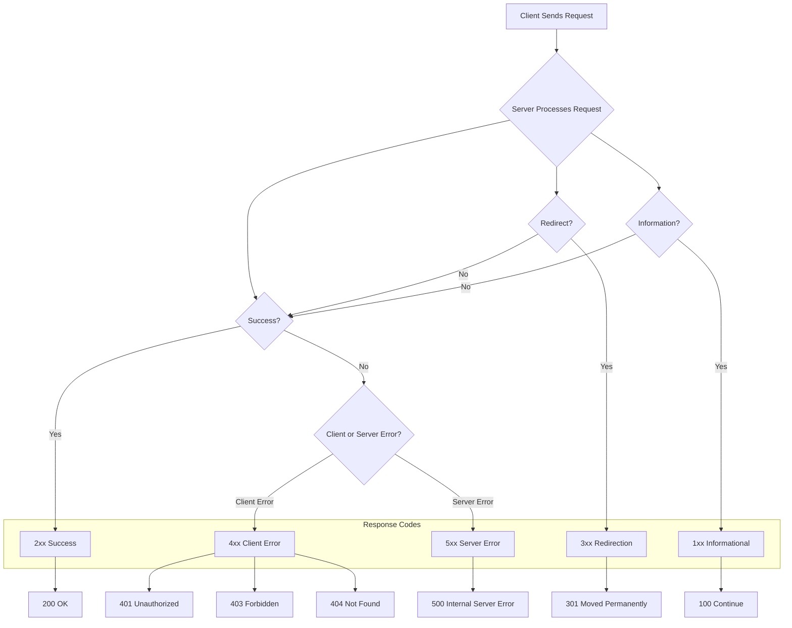

```mermaid
graph TD
    A[Client Sends Request] --> B{Server Processes Request};
    B --> C{Success?};
    C -->|Yes| D[2xx Success];
    C -->|No| E{Client or Server Error?};
    E -->|Client Error| F[4xx Client Error];
    E -->|Server Error| G[5xx Server Error];
    B --> H{Redirect?};
    H --> |Yes| I[3xx Redirection];
    H --> |No| C;
    B --> J{Information?};
    J --> |Yes| K[1xx Informational];
    J --> |No| C;

    subgraph "Response Codes"
        D;
        F;
        G;
        I;
        K;
    end

   D --> D1[200 OK];
   F --> F1[401 Unauthorized];
   F --> F2[403 Forbidden];
   F --> F3[404 Not Found];
   G --> G1[500 Internal Server Error];
   I --> I1[301 Moved Permanently];
   K --> K1[100 Continue];
```
