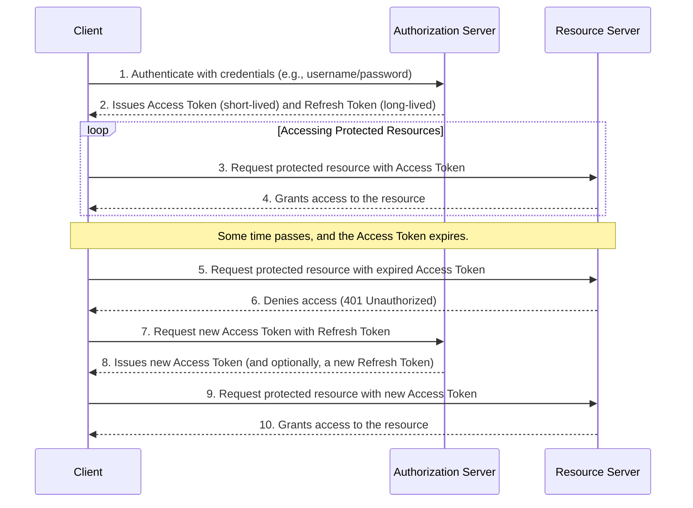
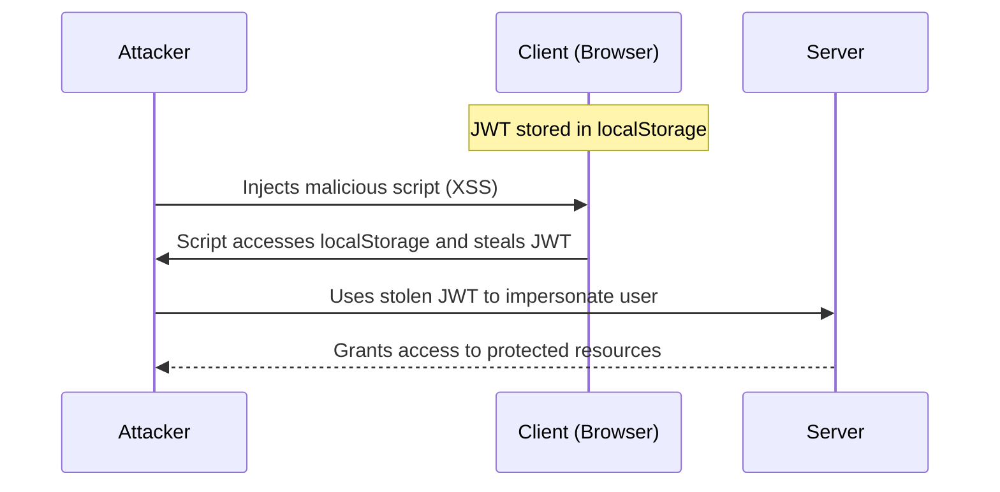
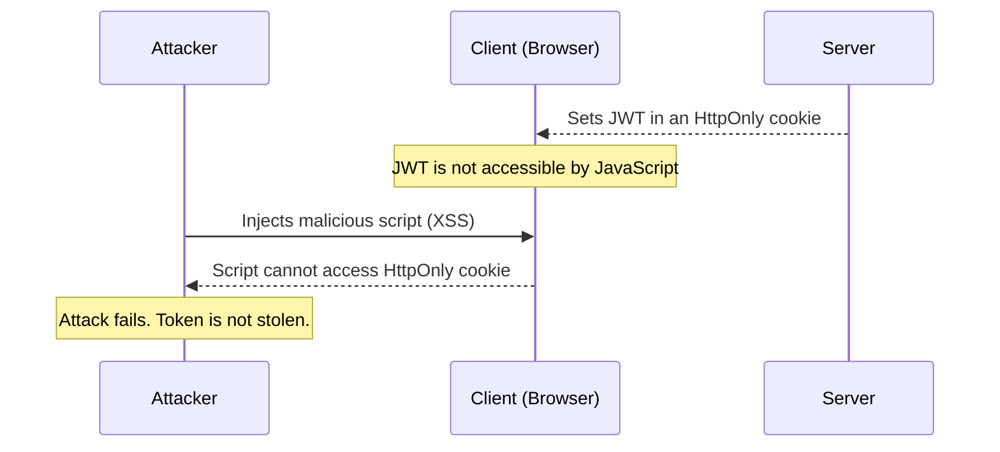
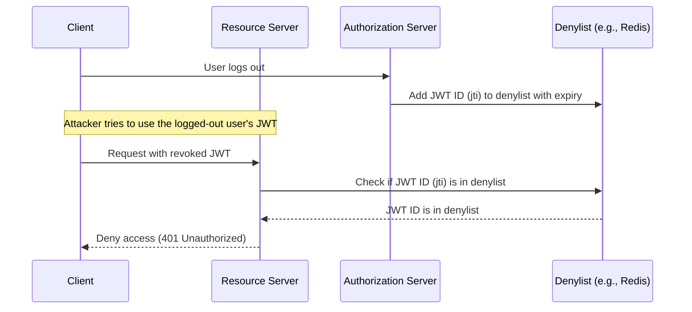
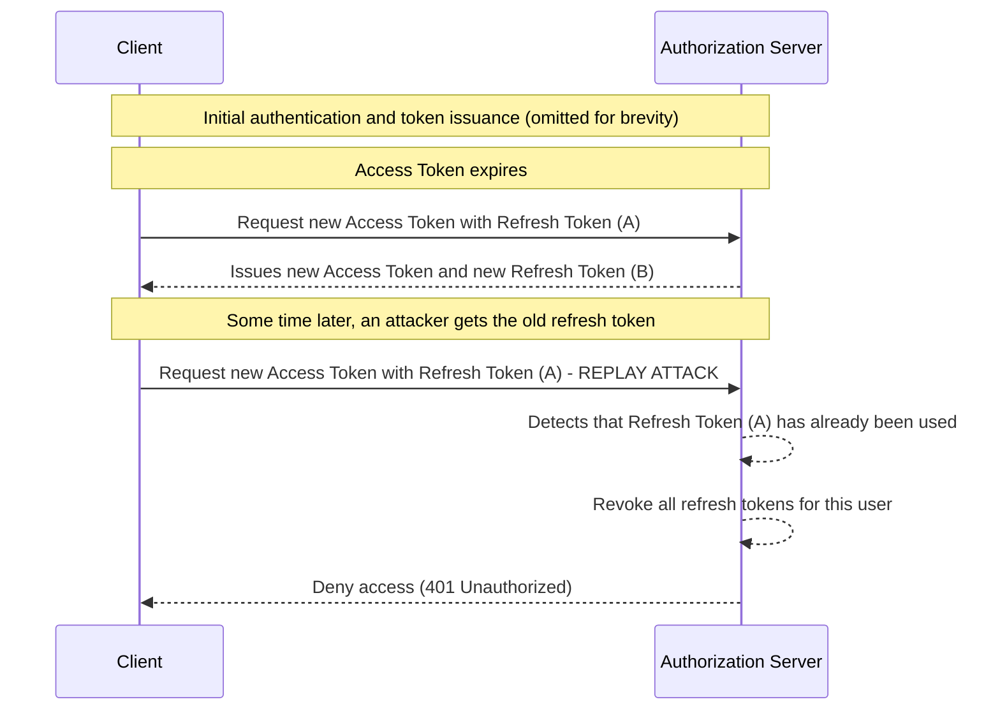

### JWT Refresh Token Flow

```mermaid
sequenceDiagram
    participant Client
    participant AuthorizationServer as Authorization Server
    participant ResourceServer as Resource Server

    Client->>AuthorizationServer: 1. Authenticate with credentials (e.g., username/password)
    AuthorizationServer-->>Client: 2. Issues Access Token (short-lived) and Refresh Token (long-lived)

    loop Accessing Protected Resources
        Client->>ResourceServer: 3. Request protected resource with Access Token
        ResourceServer-->>Client: 4. Grants access to the resource
    end

    Note over Client, ResourceServer: Some time passes, and the Access Token expires.

    Client->>ResourceServer: 5. Request protected resource with expired Access Token
    ResourceServer-->>Client: 6. Denies access (401 Unauthorized)

    Client->>AuthorizationServer: 7. Request new Access Token with Refresh Token
    AuthorizationServer-->>Client: 8. Issues new Access Token (and optionally, a new Refresh Token)

    Client->>ResourceServer: 9. Request protected resource with new Access Token
    ResourceServer-->>Client: 10. Grants access to the resource
```

### JWT stored in localStorage

```mermaid
sequenceDiagram
    participant Attacker
    participant Client (Browser)
    participant Server

    Note over Client (Browser): JWT stored in localStorage
    Attacker->>Client (Browser): Injects malicious script (XSS)
    Client (Browser)->>Attacker: Script accesses localStorage and steals JWT
    Attacker->>Server: Uses stolen JWT to impersonate user
    Server-->>Attacker: Grants access to protected resources
```

### Sets JWT in an HttpOnly cookie

```mermaid
sequenceDiagram
    participant Attacker
    participant Client (Browser)
    participant Server

    Server-->>Client (Browser): Sets JWT in an HttpOnly cookie
    Note over Client (Browser): JWT is not accessible by JavaScript
    Attacker->>Client (Browser): Injects malicious script (XSS)
    Client (Browser)-->>Attacker: Script cannot access HttpOnly cookie
    Note over Attacker: Attack fails. Token is not stolen.
```

### The Denylist Pattern

```mermaid
sequenceDiagram
    participant Client
    participant ResourceServer as Resource Server
    participant AuthorizationServer as Authorization Server
    participant DenylistCache as Denylist (e.g., Redis)

    Client->>AuthorizationServer: User logs out
    AuthorizationServer->>DenylistCache: Add JWT ID (jti) to denylist with expiry

    Note over Client, ResourceServer: Attacker tries to use the logged-out user's JWT

    Client->>ResourceServer: Request with revoked JWT
    ResourceServer->>DenylistCache: Check if JWT ID (jti) is in denylist
    DenylistCache-->>ResourceServer: JWT ID is in denylist
    ResourceServer-->>Client: Deny access (401 Unauthorized)
```

### Refresh Token Rotation

```mermaid
sequenceDiagram
    participant Client
    participant AuthorizationServer as Authorization Server

    Note over Client, AuthorizationServer: Initial authentication and token issuance (omitted for brevity)

    Note over Client, AuthorizationServer: Access Token expires

    Client->>AuthorizationServer: Request new Access Token with Refresh Token (A)
    AuthorizationServer-->>Client: Issues new Access Token and new Refresh Token (B)

    Note over Client, AuthorizationServer: Some time later, an attacker gets the old refresh token

    Client->>AuthorizationServer: Request new Access Token with Refresh Token (A) - REPLAY ATTACK
    AuthorizationServer-->>AuthorizationServer: Detects that Refresh Token (A) has already been used
    AuthorizationServer-->>AuthorizationServer: Revoke all refresh tokens for this user
    AuthorizationServer-->>Client: Deny access (401 Unauthorized)
```
