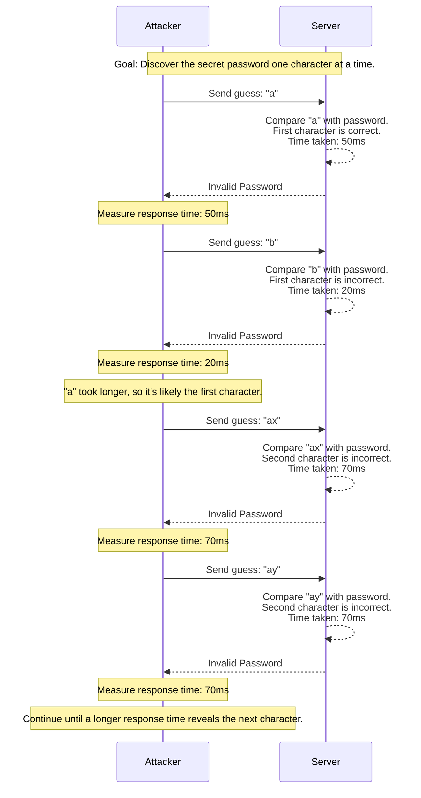

```mermaid
sequenceDiagram
    participant Attacker
    participant Server

    Note over Attacker, Server: Goal: Discover the secret password one character at a time.

    Attacker->>Server: Send guess: "a"
    Server-->>Server: Compare "a" with password.<br>First character is correct.<br>Time taken: 50ms
    Server-->>Attacker: Invalid Password
    Note over Attacker: Measure response time: 50ms

    Attacker->>Server: Send guess: "b"
    Server-->>Server: Compare "b" with password.<br>First character is incorrect.<br>Time taken: 20ms
    Server-->>Attacker: Invalid Password
    Note over Attacker: Measure response time: 20ms

    Note over Attacker: "a" took longer, so it's likely the first character.

    Attacker->>Server: Send guess: "ax"
    Server-->>Server: Compare "ax" with password.<br>Second character is incorrect.<br>Time taken: 70ms
    Server-->>Attacker: Invalid Password
    Note over Attacker: Measure response time: 70ms

    Attacker->>Server: Send guess: "ay"
    Server-->>Server: Compare "ay" with password.<br>Second character is incorrect.<br>Time taken: 70ms
    Server-->>Attacker: Invalid Password
    Note over Attacker: Measure response time: 70ms

    Note over Attacker: Continue until a longer response time reveals the next character.
```
