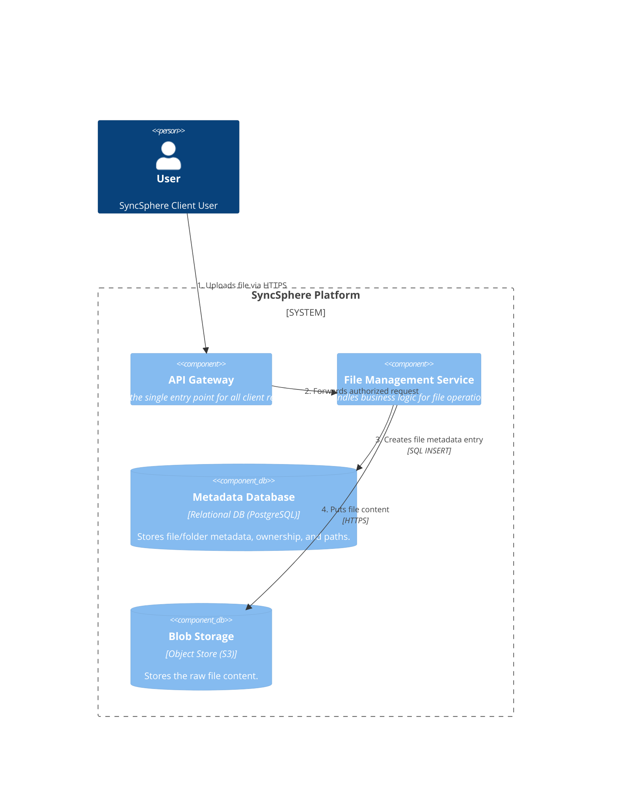
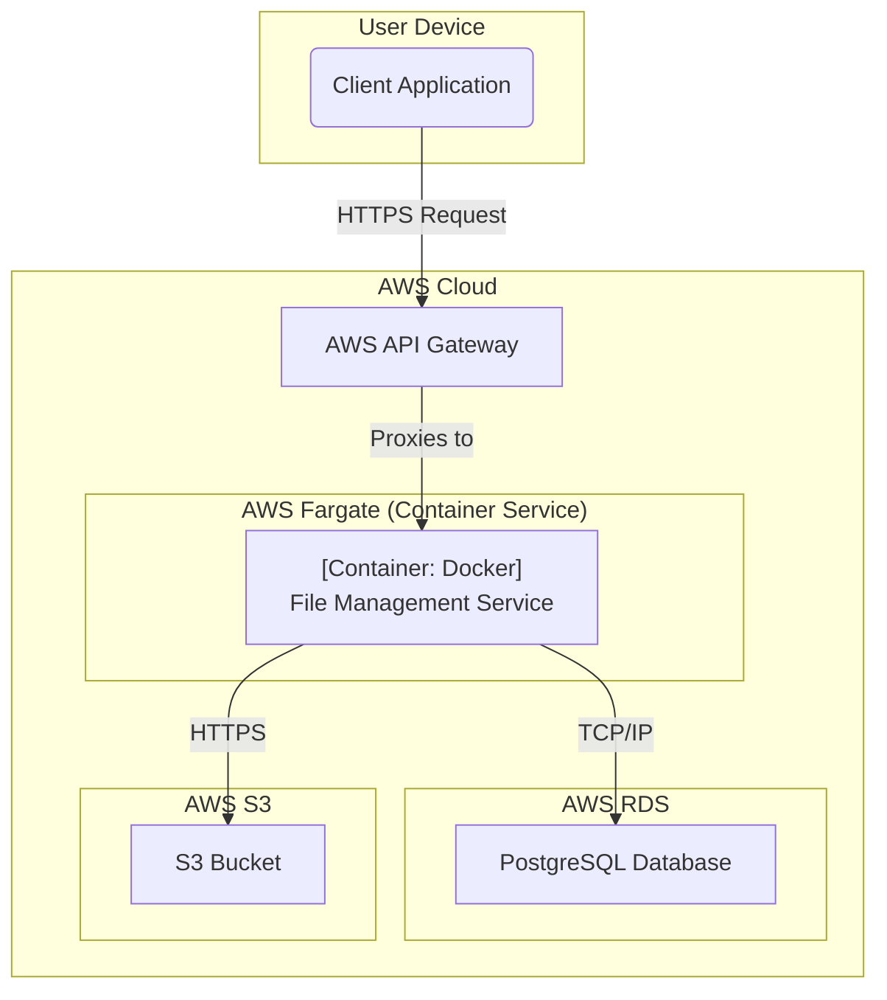

### **Core Service Scaffolding & File Ingestion**

#### **1. Problem**

To begin building SyncSphere, the system requires a fundamental architectural backbone. We need to define the essential services and infrastructure to handle the primary "happy path" use case: a user uploading a file and having it stored securely and reliably. This initial design will serve as the foundation for all subsequent features.

#### **2. Solution**

The proposed solution is a service-oriented architecture that separates concerns for handling API requests, business logic, and data storage. The core components are:

*   **API Gateway:** A single, managed entry point that receives all incoming traffic from clients. It is responsible for request routing, and in later issues, will handle concerns like authentication and rate limiting.
*   **File Management Service:** A backend service that contains the core business logic for file operations. For this issue, its primary role is to process upload requests, create an entry for the file in the metadata database, and store the file's actual contents in a blob store.
*   **Metadata Database:** A relational database to store structured information *about* the files, such as filenames, paths, sizes, and ownership. This allows for efficient querying of the file system structure.
*   **Blob Storage:** A highly durable and scalable object storage system designed to hold large, unstructured data, which is perfect for storing the raw file contents.

#### **3. Trade-offs**

*   **Architectural Pattern (Service-Oriented vs. Monolith):**
    *   **Decision:** A simple service-oriented approach was chosen.
    *   **Pros:** Establishes a clear separation of concerns from the start, allowing components to be developed, deployed, and scaled independently. This aligns with our long-term scalability goals (NFR-3).
    *   **Cons:** Slightly more initial setup complexity compared to a monolith. However, this is a worthwhile investment for future flexibility.

*   **Data Storage (Separated Metadata and Blob Storage):**
    *   **Decision:** Separate the file's metadata (in a database) from its content (in blob storage).
    *   **Pros:** This is a standard industry best practice. It leverages the strengths of each system: databases for fast, indexed queries on structured data, and blob stores for cheap, highly durable storage of large objects. This is critical for meeting performance (NFR-2) and durability (NFR-1) requirements.
    *   **Cons:** Introduces the need to manage consistency between two different data stores (e.g., ensuring a metadata entry is not created if the file upload to blob storage fails).

*   **Metadata Database Technology (Relational vs. NoSQL):**
    *   **Decision:** Use a **Relational Database (PostgreSQL)** for the initial design.
    *   **Pros:** The hierarchical nature of a file system (users own folders, folders contain files) maps naturally to a relational model with strong consistency guarantees (ACID).
    *   **Cons:** Horizontal scaling can be more complex than with NoSQL.
    *   **Rationale:** For the MVP, the benefits of a structured, consistent schema outweigh the scaling concerns. This decision can be re-evaluated in **Issue #6** when we explicitly address high-scale scenarios.

---

### **Architecture-as-Code (AaC) Artifacts**

#### **1. Logical View (C4 Component Diagram)**
*This diagram illustrates the primary logical components and their interactions for the file ingestion process.*

#### **2. Physical View (Deployment Diagram)**
*This diagram maps the logical components to specific, deployable technologies, primarily within the AWS ecosystem, following our container-first principle.*

#### **3. Component-to-Resource Mapping Table**

| Logical Component         | Physical Resource                        | Rationale                                                                                                                                                                                                                                                                                             |
| :------------------------ | :--------------------------------------- | :---------------------------------------------------------------------------------------------------------------------------------------------------------------------------------------------------------------------------------------------------------------------------------------------------- |
| **API Gateway**           | **AWS API Gateway**                      | A fully managed service that handles routing, traffic management, and security. It offloads operational burden and provides a scalable entry point without requiring us to manage our own reverse proxy infrastructure.                                                                               |
| **File Management Service** | **Docker Container on AWS Fargate**      | Using a container allows for consistent, portable deployments. Fargate is a serverless compute engine for containers, which means it automatically manages the underlying infrastructure, scaling, and patching, allowing the team to focus solely on application logic.                                |
| **Metadata Database**     | **AWS RDS for PostgreSQL**               | RDS is a managed relational database service. It automates time-consuming tasks like provisioning, patching, and backups. PostgreSQL was chosen for its robustness, feature set, and strong support for the relational data model that fits our file system hierarchy.                                   |
| **Blob Storage**          | **AWS S3**                               | S3 is the industry standard for object storage, offering virtually unlimited scalability and meeting our critical 99.999999999% durability requirement (NFR-1) out of the box. Its cost-effectiveness for storing large amounts of data is ideal for this use case.                                           |
