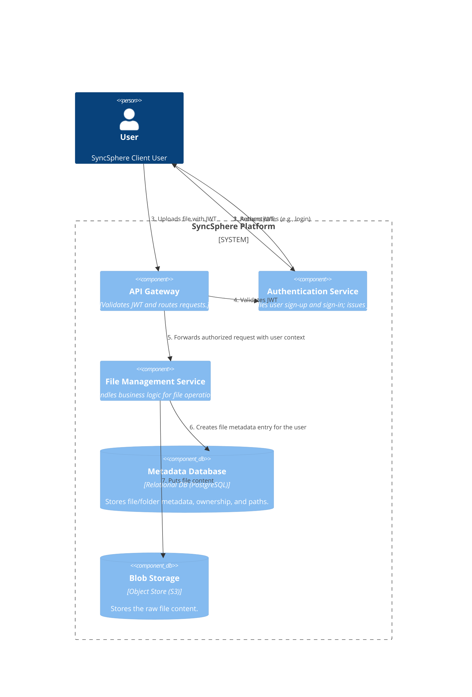
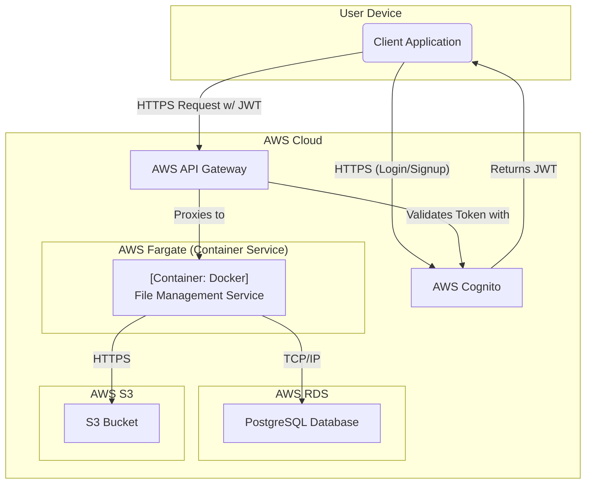

### **User Authentication & Authorization**

#### **1. Problem**

The architecture designed in Issue #1 allows for file ingestion but lacks a critical component: user identity. The system currently has no way to verify who is making a request. This means we cannot enforce that users can only upload to or manage their own files, which is a direct violation of our security requirements (NFR-4) and the core business logic.

#### **2. Solution**

To address this, we will introduce a dedicated, managed **Authentication Service** to handle all aspects of user identity. The new workflow will be as follows:

1.  **Authentication:** The user first interacts with the Authentication Service to register or sign in. Upon successful authentication, the service issues a short-lived **JSON Web Token (JWT)** to the client.
2.  **Authorization:** For all subsequent requests (like uploading a file), the client includes this JWT in the request headers.
3.  **Request Validation:** The **API Gateway** is configured to act as an authorizer. It will inspect the incoming request, extract the JWT, and validate its signature and claims (e.g., expiry date) with the Authentication Service.
4.  **Secure Forwarding:** Only if the token is valid will the API Gateway forward the request to the backend services (e.g., File Management Service). The user's identity (e.g., `user_id`) will be securely passed along in the request context.

#### **3. Trade-offs**

*   **Identity Management (Build vs. Buy):**
    *   **Decision:** Use a managed Identity as a Service (IDaaS) provider instead of building a custom authentication service. The chosen provider is **AWS Cognito**.
    *   **Pros:**
        *   **Accelerated Development:** Offloads the complex and critical work of password management, token generation, multi-factor authentication, and social logins (FR-1).
        *   **Enhanced Security:** Leverages a battle-tested service built by security experts, significantly reducing the risk of implementation flaws that could lead to breaches.
        *   **Cost-Effective for MVP:** Cognito offers a generous free tier and a pay-as-you-go model that is cost-effective at our initial scale.
    *   **Cons:**
        *   **Vendor Lock-in:** Tightly couples our user identity system to a specific cloud provider (AWS).
        *   **Less Flexibility:** We have less control over certain UI/UX aspects of the authentication flow compared to a custom solution.
    *   **Rationale:** The benefits of security, reliability, and speed-to-market far outweigh the cons. Building a custom, secure authentication service is a significant undertaking and is not a core competency of the SyncSphere project.

---

### **Architecture-as-Code (AaC) Artifacts**

#### **1. Logical View (C4 Component Diagram)**
*This diagram updates the logical view to include the Authentication Service and the new authentication flow.*

#### **2. Physical View (Deployment Diagram)**
*This diagram updates the physical view to include AWS Cognito as the implementation for our Authentication Service.*

#### **3. Component-to-Resource Mapping Table**

| Logical Component         | Physical Resource                        | Rationale                                                                                                                                                                                                                                                                                             |
| :------------------------ | :--------------------------------------- | :---------------------------------------------------------------------------------------------------------------------------------------------------------------------------------------------------------------------------------------------------------------------------------------------------- |
| **API Gateway**           | **AWS API Gateway**                      | A fully managed service that handles routing, traffic management, and security. It offloads operational burden and provides a scalable entry point.                                                                                                                                                  |
| **Authentication Service**  | **AWS Cognito**                          | A managed Identity Provider (IdP) that handles user registration, authentication, and token management. It is a secure, scalable, and cost-effective solution that integrates natively with AWS API Gateway for request authorization, fulfilling FR-1 and NFR-4.                                     |
| **File Management Service** | **Docker Container on AWS Fargate**      | A serverless compute engine for containers. It allows us to run our business logic without managing the underlying server infrastructure, aligning with modern, scalable deployment practices.                                                                                                            |
| **Metadata Database**     | **AWS RDS for PostgreSQL**               | A managed relational database service. PostgreSQL provides the necessary structure and consistency for our file system's metadata.                                                                                                                                                                      |
| **Blob Storage**          | **AWS S3**                               | The industry-leading object storage service, providing the extreme durability (NFR-1) and scalability needed for storing user file content.                                                                                                                                                             |
