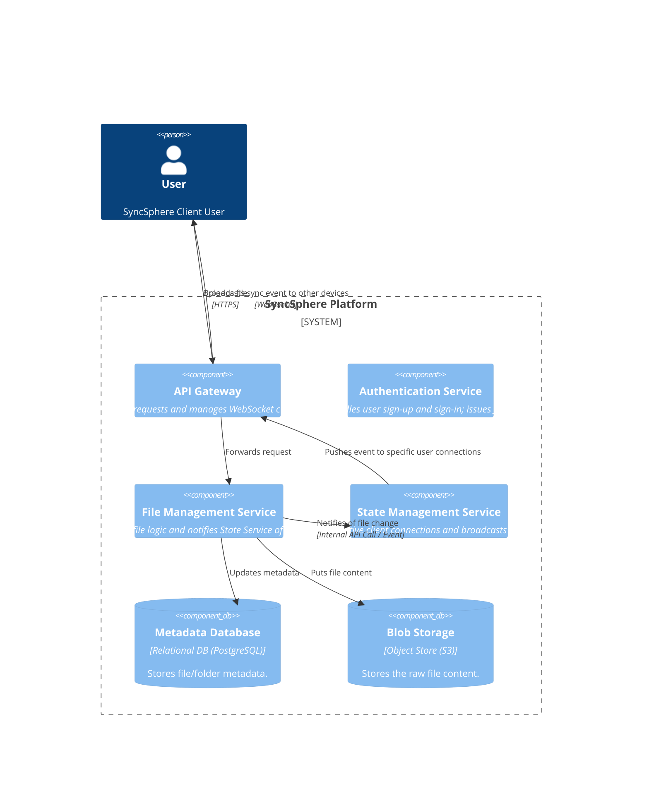
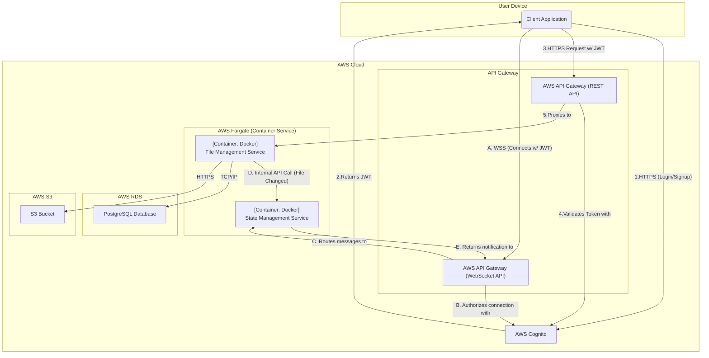

### **Real-Time Client State Synchronization**

#### **1. Problem**

The current architecture allows users to upload files, but it lacks a mechanism for the server to proactively notify other connected clients about changes. To fulfill the core requirement of automated cross-device sync (FR-3) with low latency (NFR-2), we need a persistent, real-time communication channel. Without this, a user's desktop client would not know that a file was updated from their mobile device until it manually polled for changes, which is inefficient and does not provide a seamless experience.

#### **2. Solution**

We will introduce a new dedicated **State Management Service** and a **WebSocket**-based communication channel.

1.  **Connection Establishment:** After a user logs in, their client application will establish a persistent WebSocket connection with the system via the API Gateway.
2.  **Service Responsibility:** A new `State Management Service` will be responsible for managing these WebSocket connections, keeping track of which user is connected on which device.
3.  **Event Broadcasting:** When the `File Management Service` successfully completes an operation (e.g., a file is created, modified, or deleted), it will notify the `State Management Service`.
4.  **Client Notification:** The `State Management Service` will then look up all active connections for the user who owns the file and push a small notification message (e.g., `{"file_id": "xyz", "event": "updated"}`) down the WebSocket to all other connected clients.
5.  **Client Action:** Upon receiving the notification, the client applications will know to contact the `File Management Service` to download the latest version of the specified file.

#### **3. Trade-offs**

*   **Communication Protocol (Long Polling vs. WebSockets vs. SSE):**
    *   **Decision:** Use **WebSockets** as the communication protocol.
    *   **Pros:**
        *   **Low Latency:** Provides a persistent, full-duplex (two-way) connection, which is the most efficient and lowest-latency option for true real-time communication.
        *   **Future-Proof:** The bidirectional nature of WebSockets is highly flexible and can support future collaborative features (like live editing or presence indicators) without requiring architectural changes.
        *   **Efficient:** Avoids the overhead of repeatedly establishing HTTP connections, which is common with polling techniques.
    *   **Cons:**
        *   **Complexity:** Managing a large number of persistent connections can be more complex than stateless HTTP.
    *   **Rationale:** The superior performance and future-proofing benefits of WebSockets directly align with our core product vision and non-functional requirements. By using a managed service like AWS API Gateway's WebSocket API, we can mitigate the operational complexity.

---

### **Architecture-as-Code (AaC) Artifacts**

#### **1. Logical View (C4 Component Diagram)**
*This diagram introduces the State Management Service and illustrates the real-time event flow.*

#### **2. Physical View (Deployment Diagram)**
*This diagram adds the new State Management Service running on Fargate and shows the use of a WebSocket API on AWS API Gateway.*

#### **3. Component-to-Resource Mapping Table**

| Logical Component         | Physical Resource                        | Rationale                                                                                                                                                                                                                                                                                             |
| :------------------------ | :--------------------------------------- | :---------------------------------------------------------------------------------------------------------------------------------------------------------------------------------------------------------------------------------------------------------------------------------------------------- |
| **API Gateway**           | **AWS API Gateway (REST & WebSocket APIs)** | We now use two capabilities of API Gateway. The REST API for standard requests (upload, download) and the WebSocket API, a managed service specifically designed to handle persistent, stateful WebSocket connections at scale. This is the ideal choice for implementing our real-time layer. |
| **Authentication Service**  | **AWS Cognito**                          | A managed IdP for secure and scalable user identity management.                                                                                                                                                                                                                                       |
| **File Management Service** | **Docker Container on AWS Fargate**      | A serverless compute engine for our core file logic container.                                                                                                                                                                                                                                          |
| **State Management Service**| **Docker Container on AWS Fargate**      | As a new microservice, Fargate is the consistent and logical choice for deployment. It will handle the business logic of tracking connections and dispatching events, while API Gateway manages the connections themselves.                                                                               |
| **Metadata Database**     | **AWS RDS for PostgreSQL**               | A managed relational database for storing our structured file metadata.                                                                                                                                                                                                                               |
| **Blob Storage**          | **AWS S3**                               | A highly durable object store for the raw file content.                                                                                                                                                                                                                                               |
