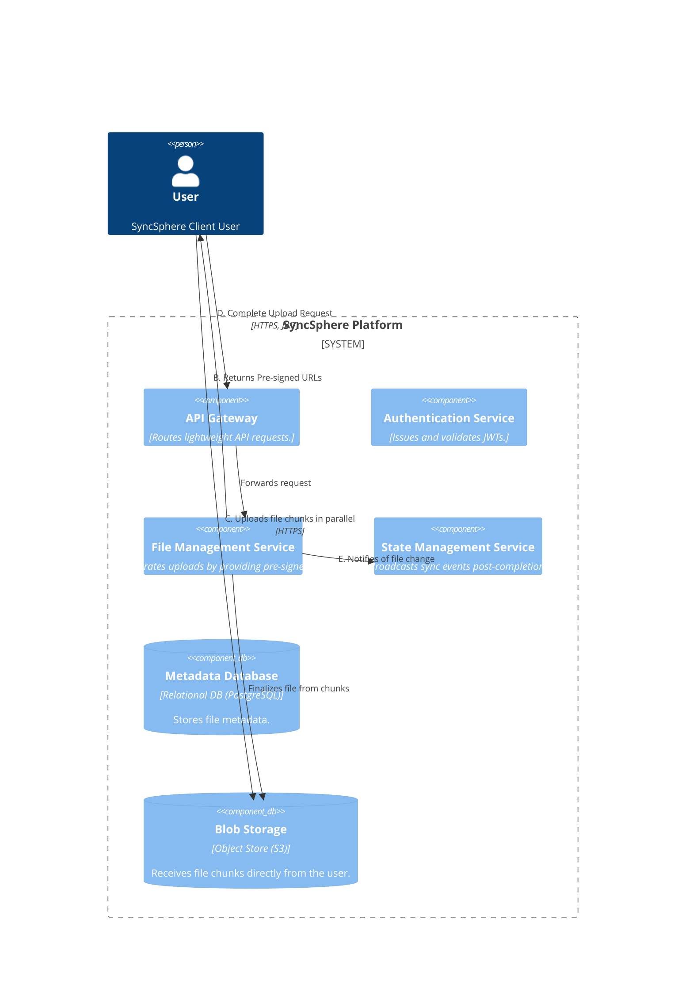
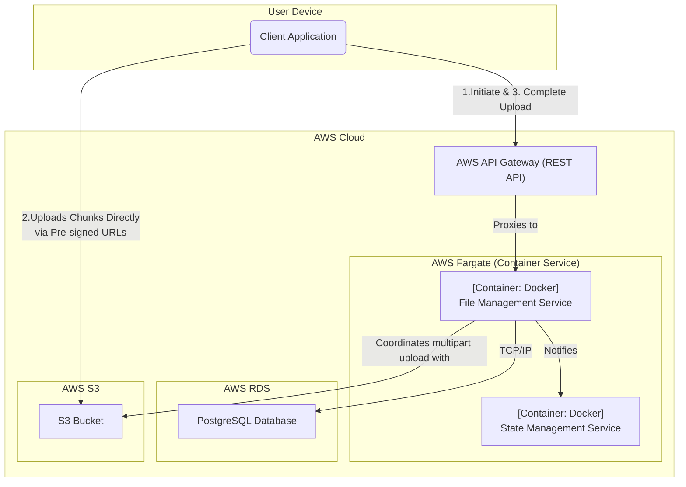

### **Large File Upload Optimization**

#### **1. Problem**

The current architecture, designed for basic file ingestion, treats a file upload as a single request that is proxied through our `File Management Service`. This model is not viable for the large files SyncSphere must support (up to 10 GB per NFR-3). A single, long-running HTTP stream is prone to failure from network interruptions, request timeouts, and would place an unsustainable memory and CPU load on our core service containers.

#### **2. Solution**

We will implement a **multipart upload pattern using pre-signed URLs**. This offloads the heavy lifting of data transfer from our services directly to the highly scalable blob storage infrastructure.

The workflow will be as follows:

1.  **Initiate Upload:** The client first sends a request to the `File Management Service` with the file's name and size, signaling its intent to upload a large file.
2.  **Generate Pre-signed URLs:** The `File Management Service` communicates with the Blob Storage (S3) to initiate a "multipart upload" transaction. It receives a unique `Upload ID` and generates a set of secure, short-lived **pre-signed URLs**, one for each chunk of the file. It then returns this `Upload ID` and the list of URLs to the client.
3.  **Direct Parallel Upload:** The client breaks the file into chunks and uses the pre-signed URLs to upload each chunk directly and in parallel to the Blob Storage. This traffic **bypasses our service layer entirely**.
4.  **Complete Upload:** After all chunks have been successfully uploaded, the client sends a final request to the `File Management Service`, including the `Upload ID` and metadata about the uploaded chunks.
5.  **Finalize File:** The `File Management Service` sends a "complete" command to the Blob Storage, which then assembles the chunks into a single, coherent file object. Only after this finalization is the file considered successfully uploaded, and the notification process (designed in Issue #3) is triggered.

#### **3. Trade-offs**

*   **Upload Pattern (Service-Proxied vs. Direct-to-Storage):**
    *   **Decision:** Implement the **direct-to-storage pattern** with pre-signed URLs.
    *   **Pros:**
        *   **Massive Scalability & Reliability:** This is the most critical benefit. It removes our `File Management Service` as a bottleneck for data transfer, allowing the system to scale horizontally to handle thousands of concurrent uploads.
        *   **Improved Performance:** Client-side parallel uploading of chunks can significantly reduce the total upload time for the user.
        *   **Enhanced Security:** Pre-signed URLs are secure, granting temporary, specific permissions without exposing long-term credentials.
    *   **Cons:**
        *   **Increased Client Complexity:** The client application must now contain the logic to perform file chunking, manage parallel uploads, and handle retries for individual failed chunks.
    *   **Rationale:** The benefits in scalability and performance are essential to meeting our core NFRs. The added client-side logic is a standard and necessary complexity for any modern, high-performance file synchronization application.

---

### **Architecture-as-Code (AaC) Artifacts**

#### **1. Logical View (C4 Component Diagram)**
*This diagram refines the upload process, showing the new multi-step coordination flow for large files.*

#### **2. Physical View (Deployment Diagram)**
*This diagram updates the interactions to show the client communicating directly with S3 for data transfer.*

#### **3. Component-to-Resource Mapping Table**

| Logical Component         | Physical Resource                        | Rationale                                                                                                                                                                                                                                                                                             |
| :------------------------ | :--------------------------------------- | :---------------------------------------------------------------------------------------------------------------------------------------------------------------------------------------------------------------------------------------------------------------------------------------------------- |
| **API Gateway**           | **AWS API Gateway (REST API)**           | A managed service handling our lightweight coordination API calls (`initiate`, `complete`).                                                                                                                                                                                                           |
| **File Management Service** | **Docker Container on AWS Fargate**      | The service now acts as a lightweight **orchestrator** for uploads rather than a proxy for data. This is a much more scalable and cost-effective use of compute resources.                                                                                                                             |
| **State Management Service**| **Docker Container on AWS Fargate**      | (Unchanged) Handles real-time notifications to other clients once the `File Management Service` confirms a successful upload completion.                                                                                                                                                                |
| **Metadata Database**     | **AWS RDS for PostgreSQL**               | (Unchanged) Stores file metadata. An entry might be created in an "uploading" state during initiation and updated to "available" upon completion.                                                                                                                                                        |
| **Blob Storage**          | **AWS S3**                               | Now handles the heavy lifting of data ingestion directly from the client. S3's native support for multipart uploads and pre-signed URLs makes it the perfect technology for this pattern, ensuring high throughput and reliability.                                                                       |
