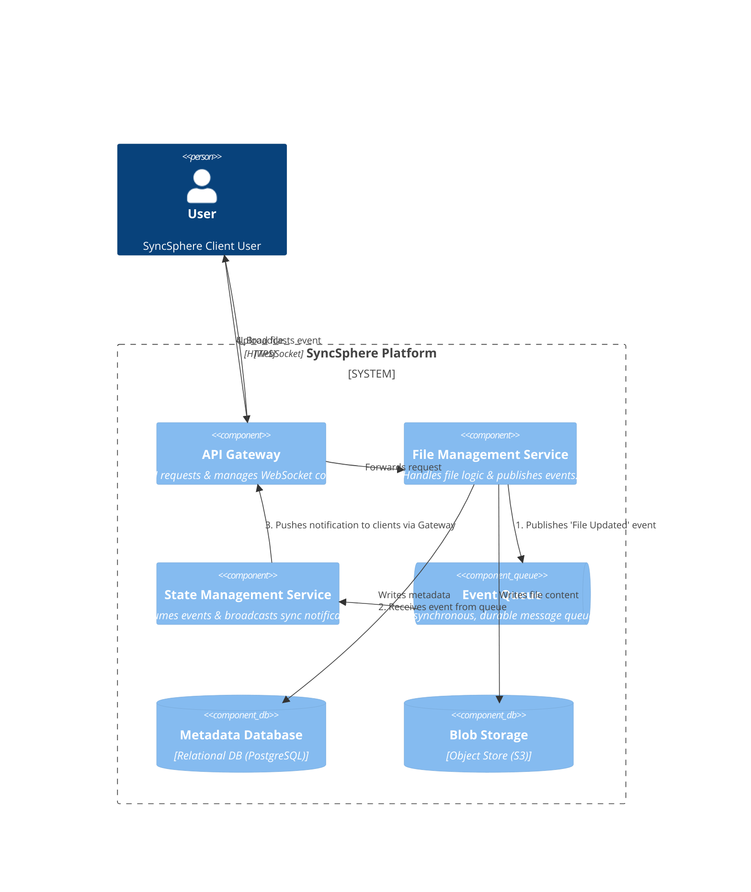
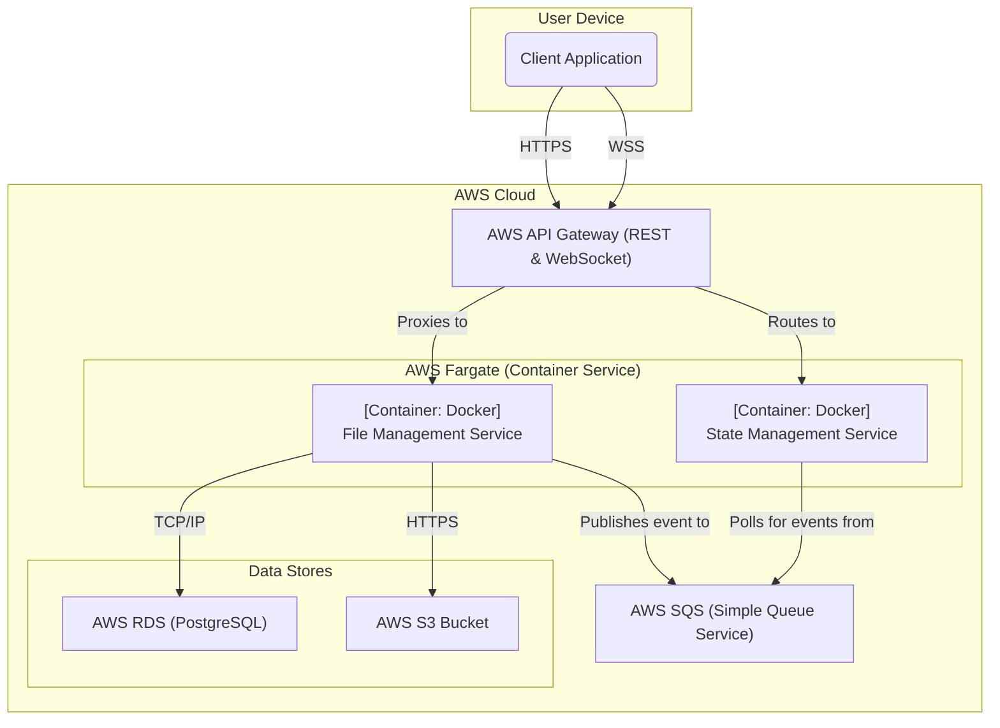

### **Asynchronous Service Decoupling**

#### **1. Problem**

In our current design, the `File Management Service` makes a direct, synchronous API call to the `State Management Service` after a file operation is completed. This creates tight coupling between the services. If the `State Management Service` is unavailable, slow, or fails, it will directly impact the `File Management Service`, potentially causing the entire upload finalization process to fail or hang. This synchronous dependency is a single point of failure that jeopardizes the system's overall availability and resilience (NFR-1).

#### **2. Solution**

To eliminate this direct dependency, we will introduce a **Message Queue** to act as a durable, asynchronous buffer between the two services.

The new event-driven workflow will be:

1.  **Publish Event:** After the `File Management Service` finalizes a file upload, instead of calling the State Service directly, it will now publish a small, lightweight event message (e.g., `{"fileId": "xyz", "userId": "abc", "eventType": "FILE_UPDATED"}`) to a dedicated queue. This action is fast and reliable. The `File Management Service` can then immediately return a success response to the client for the upload request.
2.  **Consume Event:** The `State Management Service` will act as an independent consumer. It will poll the message queue for new events.
3.  **Process and Broadcast:** Upon receiving an event from the queue, the `State Management Service` will process it and broadcast the necessary real-time notification to the clients via the WebSocket API.

This change transforms the communication from a brittle, synchronous call into a resilient, asynchronous, event-driven flow.

#### **3. Trade-offs**

*   **Inter-Service Communication (Synchronous API vs. Asynchronous Queue):**
    *   **Decision:** Use an **Asynchronous Message Queue**. The chosen technology is **AWS Simple Queue Service (SQS)**.
    *   **Pros:**
        *   **Enhanced Availability & Resilience:** The `File Management Service` is completely decoupled from the availability of the `State Management Service`. An outage in the state service will no longer cause upload operations to fail. Messages will simply queue up and be processed when the service recovers.
        *   **Improved Performance & Responsiveness:** The user-facing "complete upload" API call becomes much faster, as the `File Management Service` only needs to perform a quick "fire-and-forget" publish to the queue.
        *   **Scalability & Load Leveling:** The queue acts as a crucial buffer. During a spike in uploads, the queue can absorb the burst of events, allowing the `State Management Service` to process them at a steady rate without being overwhelmed.
    *   **Cons:**
        *   **Slightly Increased Latency:** The end-to-end time for a notification to reach a client is marginally increased by the time the message spends in the queue (typically milliseconds). This is a negligible trade-off for the massive gain in system stability and is well within our 20-second NFR.
        *   **Increased Architectural Complexity:** We are introducing a new core component (the queue) that must be provisioned and monitored.
    *   **Rationale:** Adopting an asynchronous, event-driven pattern is a foundational step in building a truly robust, large-scale distributed system. The benefits of resilience and scalability are non-negotiable for meeting our PRD goals.

---

### **Architecture-as-Code (AaC) Artifacts**

#### **1. Logical View (C4 Component Diagram)**
*This diagram introduces the Message Queue, which now mediates communication between the File and State services.*

#### **2. Physical View (Deployment Diagram)**
*This diagram adds AWS SQS to our physical architecture.*

#### **3. Component-to-Resource Mapping Table**

| Logical Component         | Physical Resource                        | Rationale                                                                                                                                                                                                                                                                                             |
| :------------------------ | :--------------------------------------- | :---------------------------------------------------------------------------------------------------------------------------------------------------------------------------------------------------------------------------------------------------------------------------------------------------- |
| **API Gateway**           | **AWS API Gateway (REST & WebSocket APIs)** | (Unchanged) Manages stateless and stateful client connections.                                                                                                                                                                                                                                       |
| **File Management Service** | **Docker Container on AWS Fargate**      | (Unchanged) Orchestrates file uploads and now publishes events.                                                                                                                                                                                                                                     |
| **State Management Service**| **Docker Container on AWS Fargate**      | (Unchanged) Manages real-time notifications, but now its workload is driven by consuming events from the queue rather than direct API calls.                                                                                                                                                          |
| **Event Queue**           | **AWS SQS (Simple Queue Service)**       | A fully managed, highly available, and scalable message queue. SQS guarantees at-least-once delivery, providing the durability needed to ensure no file update events are lost. It perfectly implements the required decoupling between our services.                                                          |
| **Metadata Database**     | **AWS RDS for PostgreSQL**               | (Unchanged) The source of truth for file metadata.                                                                                                                                                                                                                                                  |
| **Blob Storage**          | **AWS S3**                               | (Unchanged) The source of truth for file content.                                                                                                                                                                                                                                                   |
