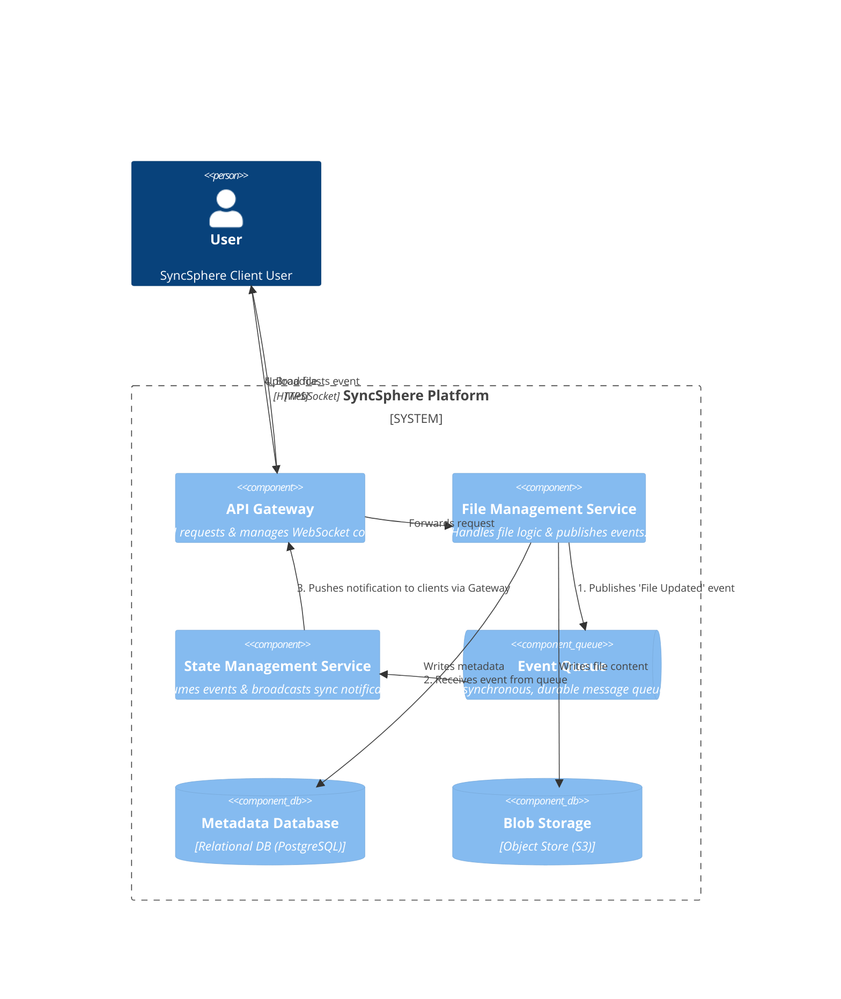
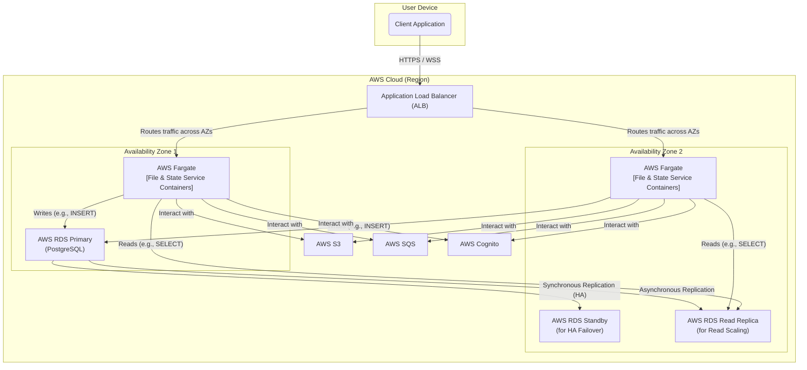

### **High Availability & Database Scaling**

#### **1. Problem**

The current physical architecture, while logically sound, has two major weaknesses that prevent it from meeting our NFRs:

1.  **Single Point of Failure:** Our services and database are conceptually deployed to a single location. An outage in a single server or an entire AWS Availability Zone (AZ) would render the entire SyncSphere platform unavailable, violating our 99.95% availability requirement (NFR-1).
2.  **Database Bottleneck:** As we scale to millions of users, a single PostgreSQL instance will be overwhelmed. The workload will be read-heavy (users listing/browsing files), but the primary instance must handle both reads and writes, creating a significant performance bottleneck and jeopardizing our latency goals (NFR-2).

#### **2. Solution**

We will evolve the physical deployment strategy to be fully redundant across multiple Availability Zones and scale our database's read capacity.

1.  **Multi-AZ Service Deployment:** The stateless `File Management Service` and `State Management Service` containers will be deployed across multiple (at least two) Availability Zones. An **Application Load Balancer (ALB)** will be placed in front of them to distribute traffic, automatically routing requests away from any unhealthy instances or zones.
2.  **High-Availability Database:** The AWS RDS for PostgreSQL database will be configured for **Multi-AZ deployment**. This creates a synchronous, hot-standby replica in a separate AZ. In the event of a primary instance failure, AWS will automatically and transparently fail over to the standby, minimizing downtime.
3.  **Database Read Scaling:** To handle the high volume of read operations, we will add one or more **Read Replicas** to our RDS instance. The `File Management Service` will be configured to direct all read queries (e.g., `SELECT` statements for listing files) to these replicas, while all write operations (`INSERT`, `UPDATE`, `DELETE`) will continue to go to the primary instance. This CQS (Command Query Responsibility Segregation) pattern at the database level dramatically increases read throughput.

#### **3. Trade-offs**

*   **Database Scaling Strategy (PostgreSQL with Read Replicas vs. NoSQL):**
    *   **Decision:** Enhance the existing PostgreSQL with Multi-AZ and Read Replicas.
    *   **Pros:**
        *   **Solves Immediate Problem:** Effectively addresses both high availability and the read-scaling bottleneck without a disruptive migration.
        *   **Maintains Strong Consistency:** We retain the benefits of ACID compliance for our critical metadata writes.
        *   **Incremental Change:** This is a less complex and lower-risk change than a full migration to a different database technology.
    *   **Cons:**
        *   **Doesn't Solve Write Scaling:** This pattern does not scale database *writes*. As the user base grows further, write operations on the single primary instance will eventually become the new bottleneck.
    *   **Rationale:** This is the most pragmatic next step. It fully meets our immediate NFRs for availability and read performance. We acknowledge that future, extreme-scale growth will require a more complex write-scaling strategy, such as sharding or a migration to a horizontally scalable NoSQL database like Amazon DynamoDB. That migration would be a major project for a future roadmap (e.g., SyncSphere v2.0).

---

### **Architecture-as-Code (AaC) Artifacts**

#### **1. Logical View (C4 Component Diagram)**

**No change.**

High availability and database scaling are primarily concerns of the *physical* architecture. The logical components and their responsibilities remain the same. The `File Management Service` still logically interacts with a single `Metadata Database`; how that database is physically replicated and scaled is an implementation detail of this issue.

#### **2. Physical View (Deployment Diagram)**
*This diagram is significantly updated to show our new multi-AZ, highly-available, and read-scalable architecture.*

#### **3. Component-to-Resource Mapping Table**

| Logical Component         | Physical Resource                        | Rationale (Updates in bold)                                                                                                                                                                                                                                                                           |
| :------------------------ | :--------------------------------------- | :------------------------------------------------------------------------------------------------------------------------------------------------------------------------------------------------------------------------------------------------------------------------------------------------------ |
| **API Gateway**           | **AWS API Gateway**                      | (Unchanged) This service is inherently highly available and scalable across multiple AZs by default.                                                                                                                                                                                                  |
| **File/State Services**   | **Docker Containers on AWS Fargate (Multi-AZ)** | **The services are now deployed across multiple AZs behind a Load Balancer.** This ensures that the failure of a single container or an entire AZ will not cause a system-wide outage, fulfilling the availability requirement (NFR-1).                                                              |
| **Metadata Database**     | **AWS RDS for PostgreSQL (Multi-AZ with Read Replicas)** | **The database is now configured for High Availability via a synchronous Multi-AZ standby replica. Read performance is scaled horizontally by directing SELECT queries to one or more asynchronous Read Replicas.** This architecture meets our availability (NFR-1) and performance (NFR-2) goals. |
| **Blob Storage / Event Queue** | **AWS S3 / AWS SQS**                  | (Unchanged) These services are inherently multi-AZ and highly available by default, requiring no specific architectural changes on our part.                                                                                                                                                                 |
