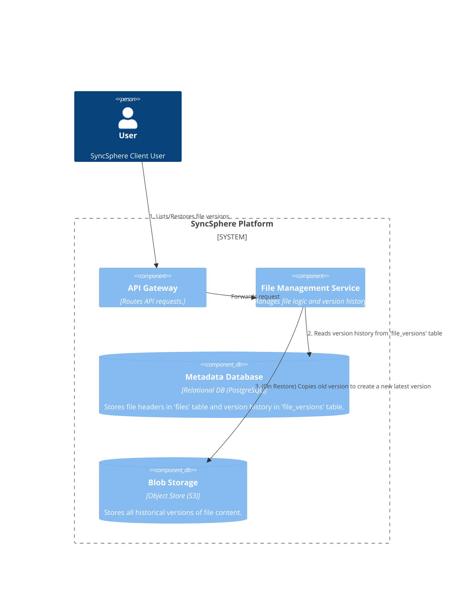
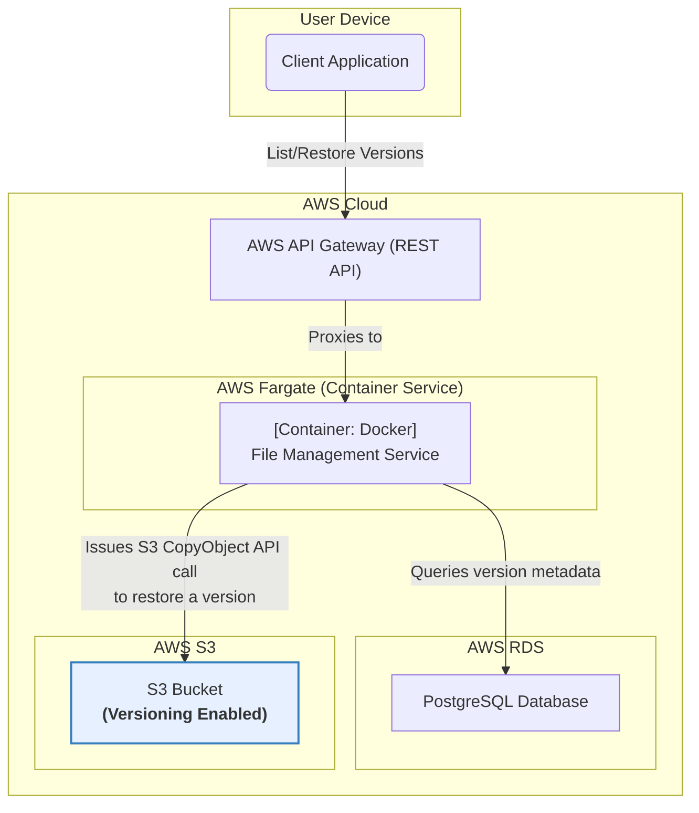

### **File Versioning System**

#### **1. Problem**

The current architecture only maintains the latest version of a file. When a user uploads a modification, the previous file content is overwritten in the blob store. This does not meet the functional requirement (FR-7) which states that users must be able to view and restore file versions from the last 30 days. We need a mechanism to preserve historical file content and the metadata to access it.

#### **2. Solution**

We will implement a versioning system that leverages the native capabilities of our chosen blob storage (AWS S3) and updates our metadata model to track version history.

1.  **Enable Blob Storage Versioning:** We will enable versioning on our S3 bucket. When this feature is active, uploading a file with an existing key (i.e., overwriting it) will no longer replace the old data. Instead, S3 will automatically create a new, distinct version of the object, accessible via a unique `Version ID`.
2.  **Update Metadata Schema:** The `Metadata Database` will be updated to track these versions. We will use a two-table schema:
    *   A `files` table will store the primary "header" information for a file, including a pointer to its *latest* version.
    *   A new `file_versions` table will store an immutable record for every version that ever existed, linking back to the main file and storing the specific `S3 Version ID`.
3.  **Modify Service Logic:**
    *   **On Upload:** When the `File Management Service` finalizes an upload, S3 will return the `Version ID` of the newly created object. The service will then create a new entry in the `file_versions` table and update the `latest_version_id` in the main `files` table.
    *   **New "List Versions" API:** A new endpoint (`GET /files/{id}/versions`) will be added to query the `file_versions` table and return the version history.
    *   **New "Restore Version" API:** A new endpoint (`POST /files/{id}/versions/{version_id}/restore`) will be added. This will instruct the `File Management Service` to perform a copy operation within S3, making a copy of the old version and setting it as the new latest version. This action creates a *new* version, preserving the full history.

#### **3. Trade-offs**

*   **Versioning Strategy (Native Blob Store vs. Manual Snapshots):**
    *   **Decision:** Use **native S3 versioning**.
    *   **Pros:** Highly reliable, durable, and operationally simple. It automatically handles the complex work of preserving old data and preventing accidental deletion. This is the most robust and straightforward approach.
    *   **Cons:** Tightly couples our versioning logic to a specific S3 feature, making a potential future migration to a different storage provider more complex.
    *   **Rationale:** The operational simplicity and high reliability of a native, managed feature far outweigh the risk of vendor lock-in for this core capability. Building this manually is error-prone and adds unnecessary complexity.

*   **Metadata Schema (Single Table vs. Two Tables):**
    *   **Decision:** Use a **two-table schema** (`files` and `file_versions`).
    *   **Pros:** This is a clean, normalized design. It allows for very fast queries for common operations like listing the files in a directory (which only needs to read the `files` table). Version history is kept separate, ensuring the primary table remains lean.
    *   **Cons:** Retrieving a file's complete history requires a `JOIN`, which is slightly less performant than querying a single, denormalized table.
    *   **Rationale:** The performance optimization for the most common use case (listing current files) is a significant advantage. The clarity and maintainability of the normalized schema are worth the minor complexity of a `JOIN` for the less frequent version history view.

---

### **Architecture-as-Code (AaC) Artifacts**

#### **1. Logical View (C4 Component Diagram)**
*This diagram is updated to reflect the new data model and the new user-facing actions for versioning.*

#### **2. Physical View (Deployment Diagram)**
*The primary change here is noting that S3 Versioning is enabled and showing the restore operation as an S3-internal copy.*

#### **3. Component-to-Resource Mapping Table**

| Logical Component         | Physical Resource                        | Rationale (Updates in bold)                                                                                                                                                                                                                                                                                   |
| :------------------------ | :--------------------------------------- | :-------------------------------------------------------------------------------------------------------------------------------------------------------------------------------------------------------------------------------------------------------------------------------------------------------------- |
| **API Gateway**           | **AWS API Gateway**                      | (Unchanged) Routes requests for the new versioning-related endpoints.                                                                                                                                                                                                                                         |
| **File Management Service** | **Docker Container on AWS Fargate**      | (Unchanged) The service's logic is updated to handle the creation and retrieval of version metadata and to orchestrate restore operations via S3 API calls.                                                                                                                                                      |
| **Metadata Database**     | **AWS RDS for PostgreSQL**               | **The schema is updated to a two-table design ('files', 'file_versions') to cleanly and efficiently manage version history.** This normalized approach optimizes for common file listing operations.                                                                                                         |
| **Blob Storage**          | **AWS S3**                               | **The S3 bucket will have its native 'Versioning' feature enabled.** This is a critical configuration change that provides the underlying mechanism for preserving all historical file content, meeting our durability and versioning requirements (FR-7) with minimal operational overhead.                |
