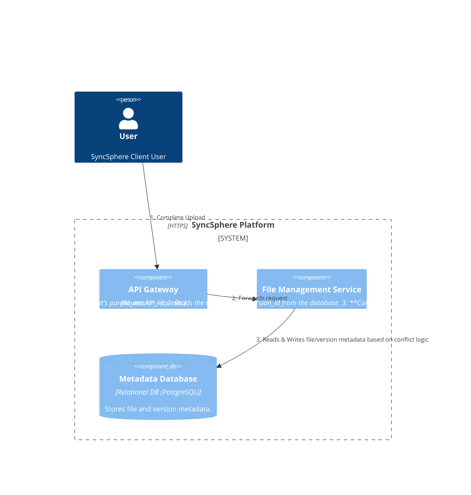
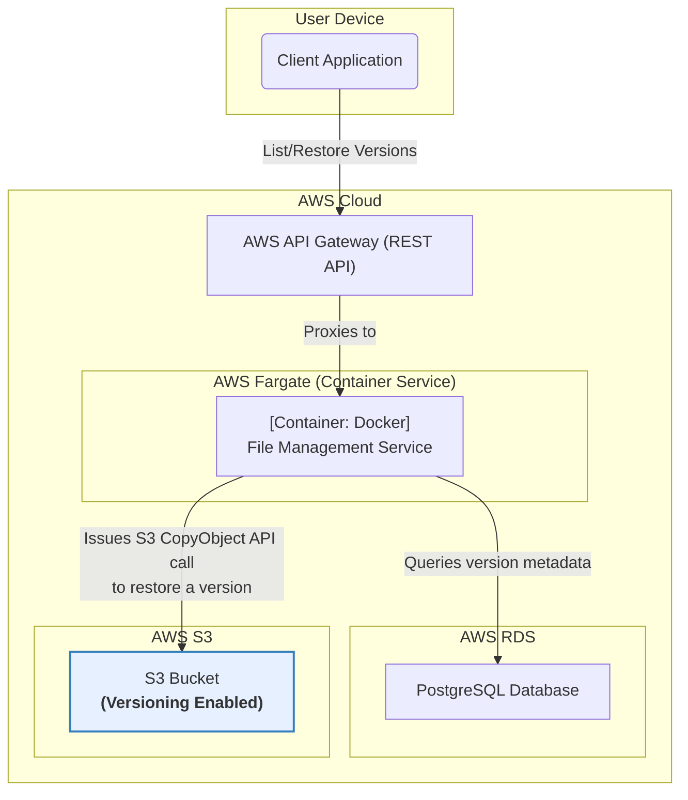

### **Conflict Resolution Strategy**

#### **1. Problem**

The system must handle synchronization conflicts gracefully, as specified in FR-5. A conflict occurs when a user modifies the same file on two different devices while one or both are offline. When both devices come online, the system must have a clear strategy to prevent one set of changes from silently overwriting the other, which would lead to data loss.

#### **2. Solution**

We will implement a server-side conflict detection and resolution strategy that prioritizes data integrity by creating a "conflicted copy" of the file.

1.  **Client-Side Context:** When a client begins to upload a modified file, it must include the `version_id` of the file it based its changes on. This is the "parent version."
2.  **Server-Side Detection:** When the `File Management Service` receives the "complete upload" request, it will perform a critical check:
    *   It will query the `Metadata Database` for the *current* latest version of the file being modified.
    *   It compares the database's latest version with the "parent version" sent by the client.
    *   **If they match:** The flow proceeds as normal (fast-forward update).
    *   **If they do not match:** A conflict is detected. This means another client has already uploaded a newer version.
3.  **Server-Side Resolution:** Upon detecting a conflict, the `File Management Service` will:
    *   Proceed with finalizing the upload from the client, creating a new version of the file in S3.
    *   Instead of updating the original file's metadata, it will create a **new file entry** in the `files` table. The name will be modified according to the PRD specification (e.g., `document (conflicted copy).txt`). This new file entry will point to the version that was just uploaded.
4.  **Notification:** The service will then publish two events to the message queue:
    *   One event for the **original file**, ensuring all clients (including the one that caused the conflict) sync down the version that "won" the race.
    *   One event for the **newly created conflicted file**, which will appear as a new file on all of the user's devices.

This approach guarantees that no work is ever lost.

#### **3. Trade-offs**

*   **Conflict Resolution Strategy (Last-Write-Wins vs. Create Conflicted Copy):**
    *   **Decision:** Create a **conflicted copy**, as mandated by the PRD (FR-5).
    *   **Pros:** This is the safest possible approach, guaranteeing zero data loss. It empowers the user to manually review both versions and merge them if necessary.
    *   **Cons:** May lead to some file clutter for users who frequently have conflicts.
    *   **Rationale:** Data integrity is the highest priority for a file synchronization service. The risk of silently overwriting a user's work with a "last-write-wins" strategy is unacceptable.

---

### **Architecture-as-Code (AaC) Artifacts**

#### **1. Logical View (C4 Component Diagram)**
*This diagram details the logic for conflict detection within the File Management Service.*

#### **2. Physical View (Deployment Diagram)**

**No change.**

This is a purely logical change implemented within the `File Management Service` and through updates to the `MetadataDB` schema. The physical components and their layout remain the same as in the previous issue. The `File Management Service` container on AWS Fargate will simply deploy new code containing this logic.

#### **3. Component-to-Resource Mapping Table**

| Logical Component         | Physical Resource                        | Rationale (Updates in bold)                                                                                                                                                                                                                                                           |
| :------------------------ | :--------------------------------------- | :-------------------------------------------------------------------------------------------------------------------------------------------------------------------------------------------------------------------------------------------------------------------------------------- |
| **API Gateway**           | **AWS API Gateway**                      | (Unchanged) Routes requests to the `File Management Service`.                                                                                                                                                                                                                           |
| **File Management Service** | **Docker Container on AWS Fargate**      | **The service's logic is updated to include the core conflict detection mechanism: comparing the client-provided parent version with the current latest version in the database before finalizing an upload.** It now also contains the logic to create a new file entry if a conflict is found. |
| **Metadata Database**     | **AWS RDS for PostgreSQL**               | **The schema of the 'files' table is updated to include a 'latest_version_id' foreign key to the 'file_versions' table.** This is crucial for enabling the fast version comparison needed for conflict detection.                                                                                   |
| **(Other Services)**      | ...                                      | (Unchanged) Other services like Blob Storage, Event Queue, etc., are not directly involved in the conflict detection logic itself, only in the subsequent actions.                                                                                                                            |
