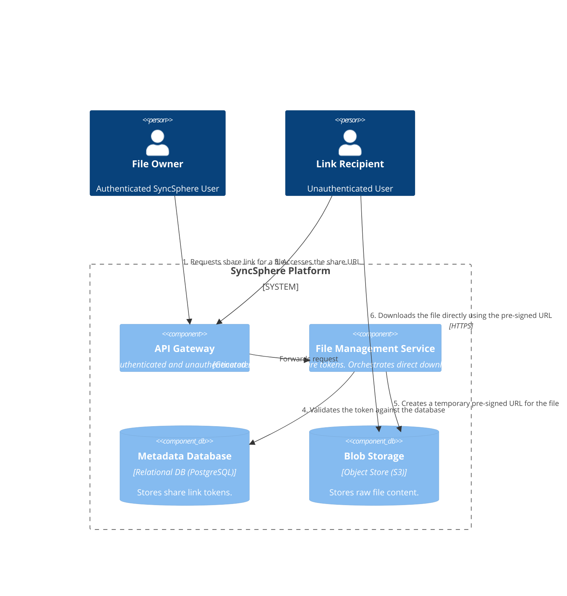
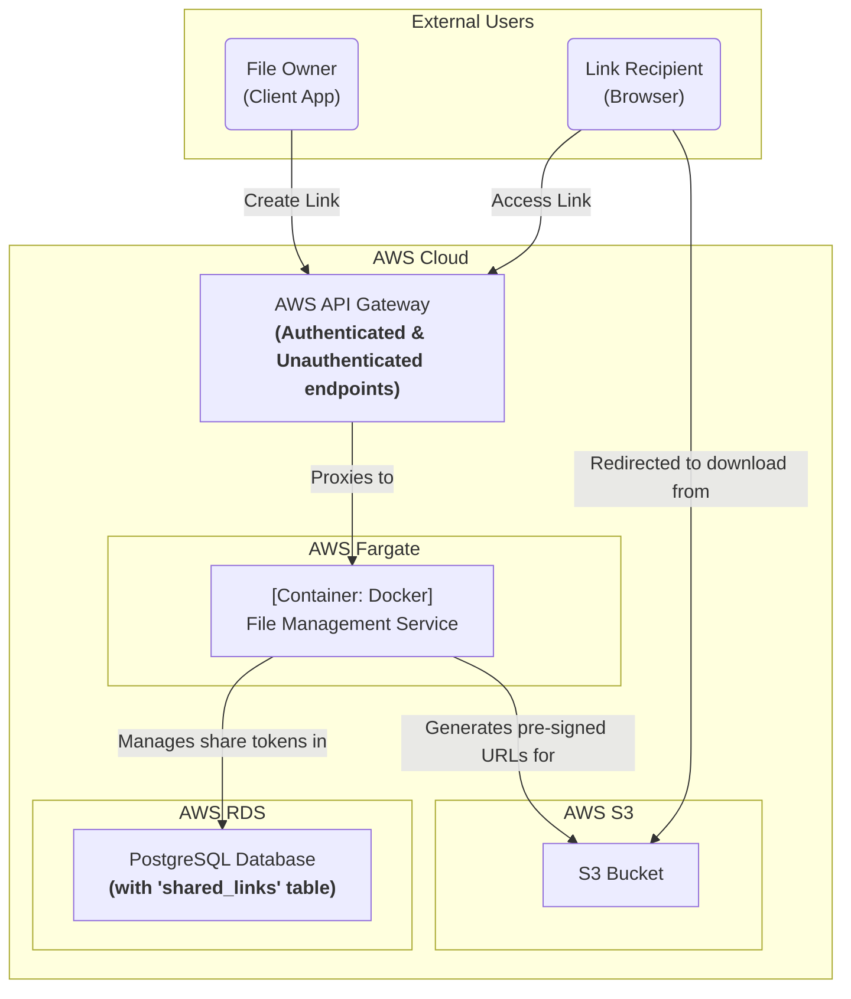

### **Secure File Sharing via Links**

#### **1. Problem**

The system needs a mechanism for users to share their files with others who may not have a SyncSphere account, as required by FR-6. This requires a secure method to grant temporary, read-only access to a specific file via a simple URL, without compromising the owner's account security or exposing the file's permanent location.

#### **2. Solution**

We will extend the `File Management Service` to generate and validate secure sharing tokens. The system will leverage pre-signed URLs to grant temporary access to the file content, ensuring the core architecture remains secure and performant.

The two main flows are:

1.  **Creating a Share Link (Authenticated User):**
    *   An authenticated user makes a request to the `File Management Service` to share a specific file.
    *   The service generates a unique, unguessable token, associates it with the `file_id` and `user_id`, sets a 30-day expiration, and stores this record in a new `shared_links` table in the `Metadata Database`.
    *   It returns the public-facing shareable URL (e.g., `syncsphere.com/share/{token}`) to the user.

2.  **Accessing a Share Link (Unauthenticated Recipient):**
    *   The recipient clicks the share link. Their browser makes a request to a new, *unauthenticated* endpoint on our `API Gateway`.
    *   The gateway forwards the request to the `File Management Service`.
    *   The service validates the token by looking it up in the `shared_links` table, checking that it exists and has not expired.
    *   If the token is valid, the service generates a very short-lived (e.g., 5-minute) pre-signed URL for the actual file object in S3 and returns an HTTP 302 Redirect to the recipient's browser.
    *   The browser automatically follows the redirect and downloads the file directly from S3.

#### **3. Trade-offs**

*   **Service Responsibility (New Sharing Service vs. Extending File Service):**
    *   **Decision:** Extend the existing **`File Management Service`**.
    *   **Pros:** Keeps the architecture lean for the MVP. Sharing logic is inherently tied to file metadata, making it a natural fit.
    *   **Cons:** A dedicated service might be preferable in the future if sharing features (e.g., permissions, collaboration) become highly complex.
    *   **Rationale:** For the MVP's simple "get link" feature, creating a new microservice would be over-engineering.

*   **Token Validation (Stateful DB Lookup vs. Stateless JWT):**
    *   **Decision:** Use a **stateful token** stored in the `Metadata Database`.
    *   **Pros:** This approach makes link revocation straightforward and secure—the user can simply "un-share" a file, and we delete the corresponding record from the database. It also allows for auditing and analytics on link usage.
    *   **Cons:** Requires a database read on every link access, adding a minor amount of latency.
    *   **Rationale:** The ability for users to revoke a shared link is a critical security and privacy feature. The performance cost of an indexed database lookup is minimal and a worthwhile trade-off for this control.

---

### **Architecture-as-Code (AaC) Artifacts**

#### **1. Logical View (C4 Component Diagram)**
*This diagram shows the two flows: an authenticated user creating a link, and an unauthenticated recipient using it.*

#### **2. Physical View (Deployment Diagram)**
*The key change is the addition of an unauthenticated endpoint on the API Gateway and the updated logic within existing services.*

#### **3. Component-to-Resource Mapping Table**

| Logical Component         | Physical Resource                        | Rationale (Updates in bold)                                                                                                                                                                                                                                                                                       |
| :------------------------ | :--------------------------------------- | :------------------------------------------------------------------------------------------------------------------------------------------------------------------------------------------------------------------------------------------------------------------------------------------------------------------ |
| **API Gateway**           | **AWS API Gateway**                      | **The gateway is now configured with a new, unauthenticated endpoint (e.g., `/share/*`) to handle incoming share links.** It will continue to enforce authentication on all other endpoints.                                                                                                                   |
| **File Management Service** | **Docker Container on AWS Fargate**      | **The service's logic is updated to include two new responsibilities: generating unique tokens for sharing and validating those tokens upon access.** It also orchestrates the final redirect by generating a pre-signed S3 URL.                                                                                    |
| **Metadata Database**     | **AWS RDS for PostgreSQL**               | **The schema is updated with a new 'shared_links' table.** This table will store the unique token, a foreign key to the `file_id`, an expiry timestamp, and potentially auditing information. This stateful approach is chosen to allow for secure link revocation.                                            |
| **Blob Storage**          | **AWS S3**                               | (Unchanged) Continues to be the secure, durable store for file content. The pre-signed URL mechanism allows it to serve files directly to unauthenticated recipients for a short period without compromising the bucket's private security policy.                                                          |
